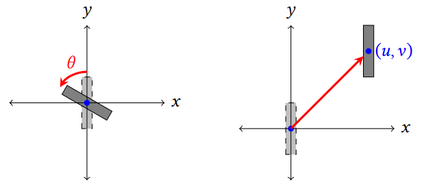

# Servoaligner Tutorial
Bowen Li
## Notations
The theoretical method follows from paper https://doi.org/10.1119/5.0083069. The lines. are defined as $r=(c,a,b)^T$, where $a,b,c$ comes from 3D line in space: $ax+by+c=0$

For the `Optical_system_solver` class you need to specify one input beam and one starting position.
In the `ray_in` variable we follow the sequence of `ray_in=[[c],[a],[b]]`.
For the orientation, the ray is oriented left-to-right if $b>0$ and vice versa. For case $b=0$, we can still identify rays with $a>0$ as going down and vice versa.

maybe it's better to see which parameter is the most sensitive one